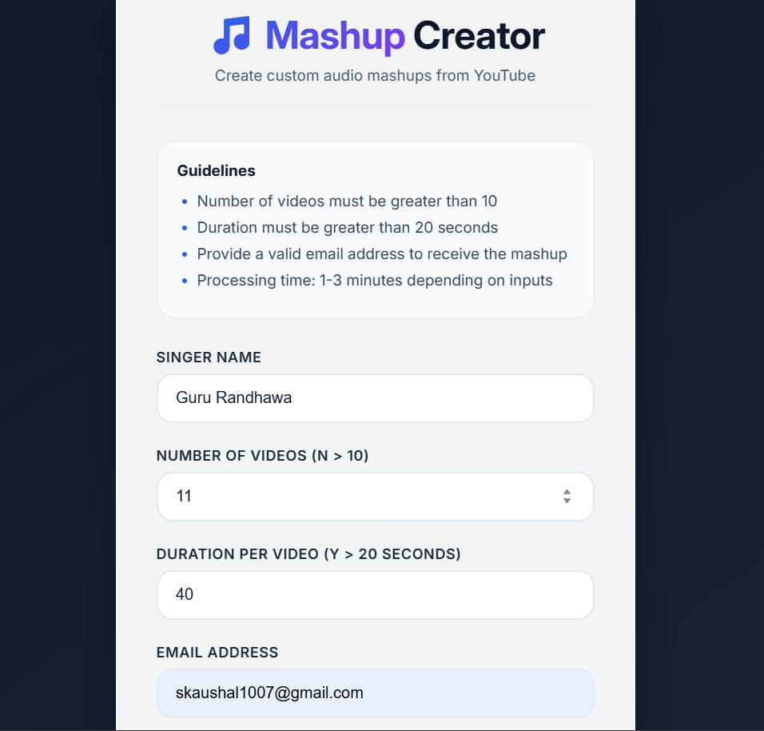
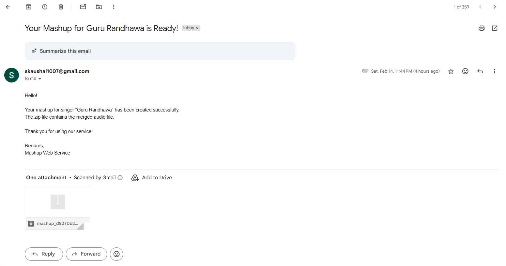

## Assignment-7: Mashup

## 📋 Overview

This project consists of two primary components developed as per the assignment requirements:
- Program 1: A command-line Python application for creating musical mashups by downloading, processing, and merging YouTube audio.
- Program 2: A Flask-based web service that provides a graphical interface for TOPSIS (Technique for Order of Preference by Similarity to Ideal Solution) calculations and result distribution via email.

## Program 1: Mashup Command Line Tool

### Description

A Python utility that automates the creation of a mashup from a specified singer's YouTube catalog. The program downloads videos, extracts audio, trims them to a specific duration, and merges them into a single output file.

### Usage
The program must be run via the command line using the following syntax:
```bash
python <RollNumber>.py <SingerName> <NumberOfVideos> <AudioDuration> <OutputFileName>
```

**Command Line Arguments:**
- **SingerName:** Name of the artist to search for.
- **NumberOfVideos:** Number of videos to process (N > 10).
- **AudioDuration:** Seconds to trim from the start of each video (Y > 20).
- **OutputFileName:** The name of the resulting .mp3 file.

### Example

```bash
python 102497023.py "Guru Randhawa" 11 30 Guru_Randhawa_Mashup.mp3
```

---

## Program 2: YouTube Mashup Web Service

### Description
This Flask-based web service provides a graphical interface for Program 1. It automates the entire pipeline—from searching YouTube to delivering a custom audio mashup directly to the user's inbox in a compressed format.

### Features

- **Automated Audio Pipeline:** Integrated with Program 1's logic to search, download, trim, and merge audio files.
- **ZIP Packaging:** Automatically compresses the final output into a .zip file before transmission.
- **Email Integration:** Sends the .zip file to the user's validated email address.

### User Interface


### Mashup Result Email


## Procedure to Run Locally

### 1. Setup Environment

Install the necessary Python libraries for audio processing and web hosting:
```bash
pip install -r requirements.txt
```

### 2. Configure SMTP Credentials
Create a `.env` file in the webapp folder:

```Plaintext
GMAIL_APP_PASSWORD=your_16_char_app_password
MAIL_USERNAME=your_email@gmail.com
```

### Start the Service

```bash
python webapp/app.py
```

Visit `http://127.0.0.1:5000` in your browser.

### Deployment Limitations

**[!WARNING]**<br>
**Firewall Block:** Live deployment on platforms like Render is currently restricted. These services block outbound **SMTP traffic (Ports 587/465)** on free tiers to prevent spam, causing the `mail.send()` function to fail.

